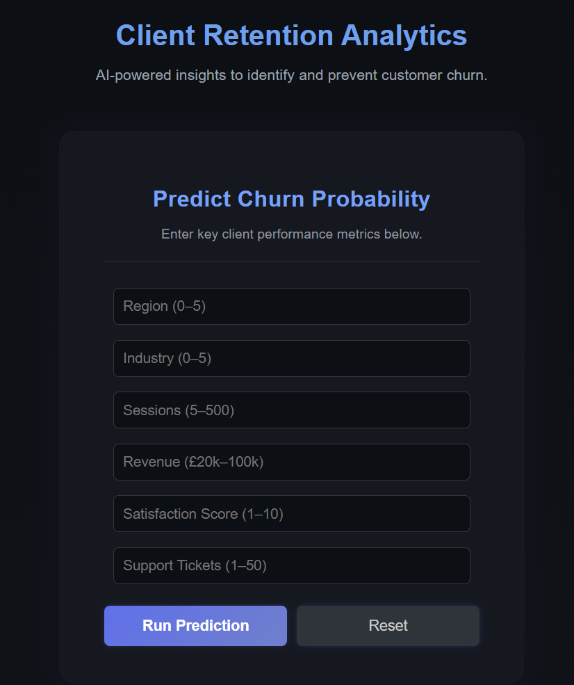
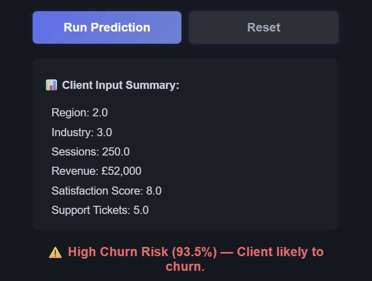

# 📊 Client Data Analysis & Churn Prediction


---

## Visual Overview

| Application Interface                                       | Sample Prediction Output                                           |
| ----------------------------------------------------------- | ------------------------------------------------------------------ |
|  |  |

---

## Overview

The **Client Data Analysis & Churn Prediction System** is an end-to-end machine learning project that analyzes client engagement and financial behavior to predict customer churn.

It combines  **data analysis** ,  **feature engineering** , and **predictive modeling** with a **Flask web interface** for real-time predictions.

This project demonstrates how data-driven insights can support customer retention strategies and improve business decision-making.

---

## Objectives

* Analyze key performance indicators (KPIs) affecting client churn.
* Build and compare predictive models using Logistic Regression and Random Forest.
* Derive actionable insights to improve retention.
* Deploy a **Flask-based web application** for interactive churn prediction.

---

## Dataset Details

| Parameter                     | Description                                   |
| ----------------------------- | --------------------------------------------- |
| **File Name**           | `client_data.csv`                           |
| **Records**             | 1,000 synthetic client entries                |
| **Target Variable**     | `churn`(1 = churned, 0 = retained)          |
| **Feature Groups**      | Demographic, Engagement, Support, Financial   |
| **Engineered Features** | `revenue_per_session`,`support_intensity` |

---

## End-to-End Pipeline

1. **Data Loading & Cleaning** – Handle missing values and anomalies.
2. **Exploratory Data Analysis (EDA)** – Identify engagement and churn trends.
3. **Feature Engineering** – Derive behavior-based metrics for prediction.
4. **Model Training** – Compare baseline and ensemble models.
5. **Model Evaluation** – Assess performance using Accuracy, ROC-AUC, and F1 score.
6. **Deployment** – Integrate the trained model with a Flask web app.

---

## Model Performance Summary

| Model                   | Accuracy       | ROC-AUC        | F1 Score       |
| ----------------------- | -------------- | -------------- | -------------- |
| Logistic Regression     | 0.87           | 0.86           | 0.84           |
| **Random Forest** | **0.91** | **0.90** | **0.89** |

> ✅ The Random Forest model achieved the best balance between accuracy and interpretability.

---

## Flask Web Application

The deployed Flask app allows users to input key client metrics (sessions, revenue, satisfaction, etc.) and receive real-time churn predictions.

**Example Prediction:**

> *✅ Retained Client (93.4% confidence) — low churn probability.*

**Features:**

* Responsive, dark-themed interface.
* Persistent input fields after prediction.
* “Reset” option for new entries.
* Real-time inference powered by the trained Random Forest model.

---

## Folder Structure

```
client_data_analysis/
│
├── churn_prediction_api.py     # Flask backend (main API)
├── client_data_analysis.ipynb  # EDA and model training notebook
├── static/
│   └── style.css               # CSS styling for the web app
├── templates/
│   └── index.html              # Web UI template
├── churn_model.pkl             # Trained Random Forest model
├── scaler.pkl                  # StandardScaler for preprocessing
├── client_data.csv             # Dataset
├── images/                     # Project images
└── README.md                   # Documentation
```

---

## Installation and Setup

```bash
git clone <repo-url>
cd client_data_analysis
pip install -r requirements.txt
python churn_prediction_api.py
```

Access the app at:

👉 [http://127.0.0.1:5000](http://127.0.0.1:5000/)

---

## Example Test Input

| Field              | Example Value |
| ------------------ | ------------- |
| Region             | 2             |
| Industry           | 3             |
| Sessions           | 180           |
| Revenue (£)       | 68000         |
| Satisfaction Score | 9             |
| Support Tickets    | 8             |

**Expected Output:**

✅ *Retained Client (92–95% confidence)*

---

## Technical Stack

| Component                   | Technology                         |
| --------------------------- | ---------------------------------- |
| **Language**          | Python 3.10+                       |
| **Framework**         | Flask                              |
| **Data Processing**   | Pandas, NumPy                      |
| **ML Algorithms**     | Logistic Regression, Random Forest |
| **Visualization**     | Matplotlib, Seaborn                |
| **Model Persistence** | Joblib                             |
| **Deployment**        | Flask Localhost / Cloud-ready      |

---

## Insights Snapshot

**Key Findings:**

* High satisfaction and engagement correlate strongly with retention.
* Clients with more than 10% support intensity show higher churn risk.
* Average revenue per active client exceeds £45,000.
* Random Forest outperforms Logistic Regression by ~4% accuracy.

---

## Future Enhancements

* Integrate dashboard-based reporting (Streamlit or Power BI).
* Enable multi-client batch predictions.
* Deploy via AWS Elastic Beanstalk or Docker.
* Add explainability using **SHAP** for feature attribution.

---

## About the Author

Developed by   **Rakshitha Venkatesh** , a Data Science enthusiast passionate about using machine learning for business optimization.

This project highlights how **AI-driven customer analytics** can help predict and reduce churn through data-driven insights.

---

## Acknowledgements

Special thanks to the open-source **Flask** and **Scikit-learn** communities for providing robust frameworks that made this project possible.

---


